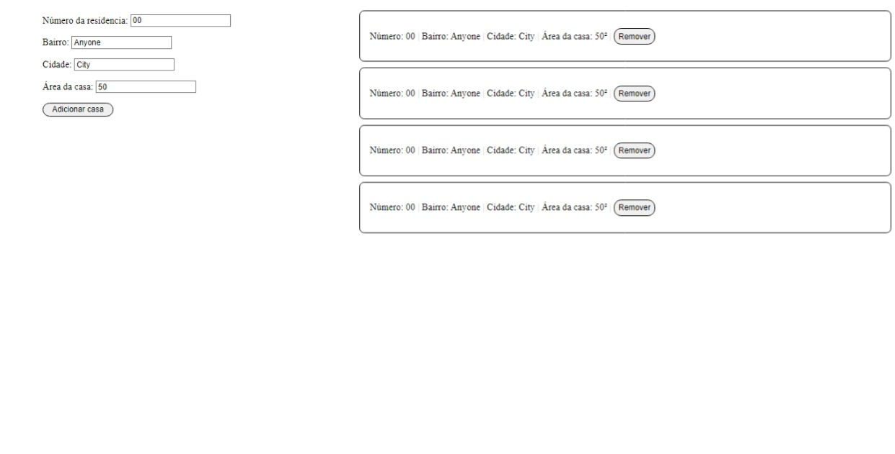

# README

Gerenciamento de contas feito por [João Pedro Monção](https://github.com/jpmoncao), com Javascript nativo com integração da API LocalStorage, para armazenar os dados cadastrados. Tendo as funcionalidades de adicionar e removar casas em uma lista.

##

## 🚀Demo

## ⏩Executando

[Execute o projeto clicando aqui](https://jpmoncao.github.io/gerenciamento-de-casas)

## ✔️Melhorias
Sistema de remoção de casas, edição das casas, design do projeto.

## 💻Stack utilizada
**Front-end:** HTML5, CSS3, Javascript

## 🛠 Habilidades
JavaScript
- Manipulação do DOM
- Eventos
- Funções
- Estruturas de repetições
- Manipulação de Arrays
- Condicionais
- API LocalStorage

## 📖Referência

 - [MDN Web Docs](https://developer.mozilla.org/pt-BR/docs/Web/JavaScript)
 - [OneBitCode FullStack JS](https://programador.onebitcode.com/)
 
## 🚹 Sobre mim
Eu sou João Pedro Monção, tenho 16 anos e atualmente estou cursando técnico em Informática. Estou estudando Front-end! Espero que curta o projeto deste repositório e aproveite para conferir meu perfil...

## 🔗 Links

## 📞Suporte

Para suporte, mande um email para pedrohjoao44@gmail.com ou joao.moncao@etec.sp.gov.br

##

Índice

  <a href="## 🚀Demo">🚀Demo, </a><a href="## ⏩Executando">⏩Executando, </a><a href="## ✔️Melhorias">✔️Melhorias, </a><a href="## 💻Stack utilizada">💻Stack utilizada, </a><a href="## 🛠 Habilidades">🛠 Habilidades, </a><a href="## 📖Referência">📖Referência, </a><a href="## 🚹 Sobre mim">🚹 Sobre mim, </a><a href="## 🔗 Links">🔗Links e </a><a href="## 📞Suporte">📞Suporte </a>

##

🚧Projeto finalizado - aberto a melhoras ^^🚧

